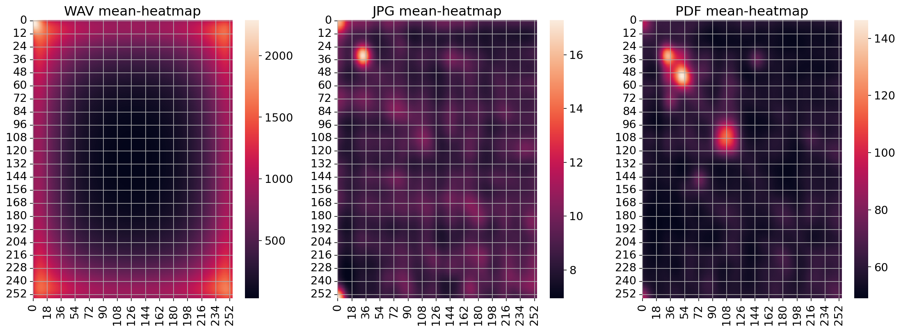
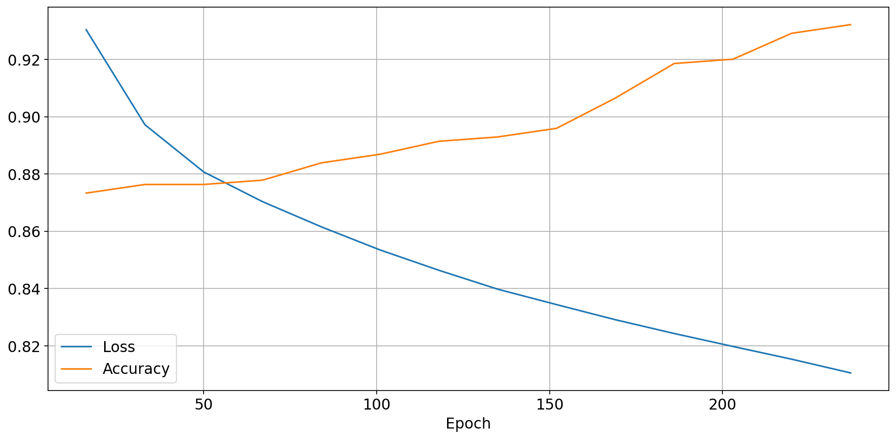

# Filetype prediction

Example of using neural networks to predict file type by it's signature. 

# Description

Idea of project is to estimate how we can predict (by using neural networks) type of file by it's *signature*.

## Signature

1. `malloc` matrix with size 256x256 and set it to zero,
2. Read file into byte array,
3. Moving along array, get byte pairs `i` and `j`,
4. Increase `matrix[i][j]` by one.

# Features

- Using neural networks from `pytorch`,
- Using `Numpy API` for fast signature calculating,

# Usage

1. Create environment via `conda` or `mamba`,

```console
$ conda env create -n filetype_prediction 
$ conda activate filetype_prediction
$ conda install -f environtment.yaml
```

2. With **activated** environment run `build.sh` to build the module,
3. Create data directory and needed subdirectories,

```console
$ mkdir -p data/{wav, pdf} # For example
```

4. Copy needed files into directories (I used `find` with `-exec` parameter),
5. Run `jupyter notebook` and run `pipeline.ipynb` notebook,
6. At the end you can see accuracy.

# Images

## Heatmap example



## Training curves



# References

- Inspiration video: https://youtu.be/AUWxl0WdiNI?si=mklboGVUC-mZ-d1M
  - Explanation of signatures collecting: https://youtu.be/4bM3Gut1hIk?si=zSGWLHKTKW7bStPb
- NumPy C-API (Python C extensions): https://youtu.be/45TOazYbedI?si=jykTbnbjcyzTsN0r
